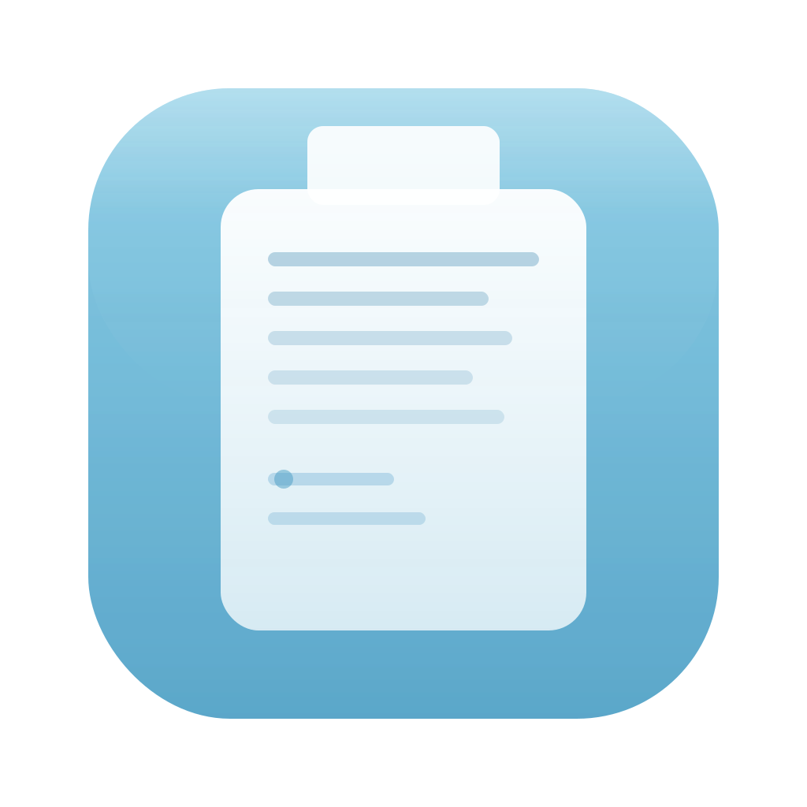

<p align="center">
  
</p>

# History Clipboard

macOS 菜单栏剪贴板历史管理工具。自动记录复制的文字与图片，随时回溯、搜索并再次粘贴。采用 **Liquid Glass** 设计风格，SwiftUI + GRDB 技术栈。

## 功能

- **自动记录** — 0.5 秒轮询，文字与图片自动入库，连续重复内容自动去重
- **历史浏览** — 菜单栏图标点击弹出 360×500pt 面板，卡片式倒序展示
- **内容搜索** — 全文搜索，输入即时过滤
- **一键回贴** — 点击卡片将内容写回剪贴板，Cmd+V 即可粘贴
- **置顶收藏** — 重要内容置顶，免于自动清理
- **自动清理** — 可设 1/3/5 天保留时长，超期非置顶记录自动清除
- **开机自启** — 通过 SMAppService 注册登录项，登录即运行

## 技术栈

| | |
|---|---|
| 语言 | Swift 6 |
| UI | SwiftUI (Liquid Glass) |
| 数据库 | GRDB 7.x (SQLite) |
| 包管理 | Swift Package Manager |
| 最低系统 | macOS 26 |

## 项目结构

```
HistoryClipboard/
├── HistoryClipboardApp.swift       # @main 入口
├── Managers/
│   ├── MenuBarManager.swift        # 菜单栏图标与 Popover
│   ├── ClipboardMonitor.swift      # 剪贴板轮询 (0.5s)
│   └── DatabaseManager.swift       # 数据库队列与 CRUD
├── Models/
│   └── ClipboardItem.swift         # GRDB Record 模型
├── Views/
│   ├── ContentView.swift           # 主面板
│   ├── ClipboardCardView.swift     # 历史卡片组件
│   ├── SearchBarView.swift         # 搜索栏
│   └── SettingsView.swift          # 设置面板
├── Services/
│   ├── PasteboardService.swift     # 粘贴板读写
│   └── CleanupService.swift        # 过期清理
└── AppSettings.swift               # 用户设置
```

## 构建

1. 安装 Xcode（macOS 26 SDK）
2. 打开 `HistoryClipboard/HistoryClipboard.xcodeproj`
3. 等待 SPM 自动解析 GRDB 依赖
4. ⌘R 运行，或 `xcodebuild -project HistoryClipboard.xcodeproj -scheme HistoryClipboard build`

## 数据存储

所有数据仅存于本地，无需网络权限：

| | 路径 |
|---|---|
| 数据库 | `~/Library/Application Support/HistoryClipboard/clipboard.db` |
| 图片 | `~/Library/Application Support/HistoryClipboard/Images/` |
| 设置 | UserDefaults |

## 许可

MIT
